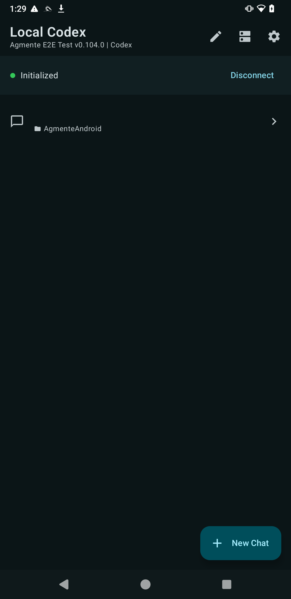
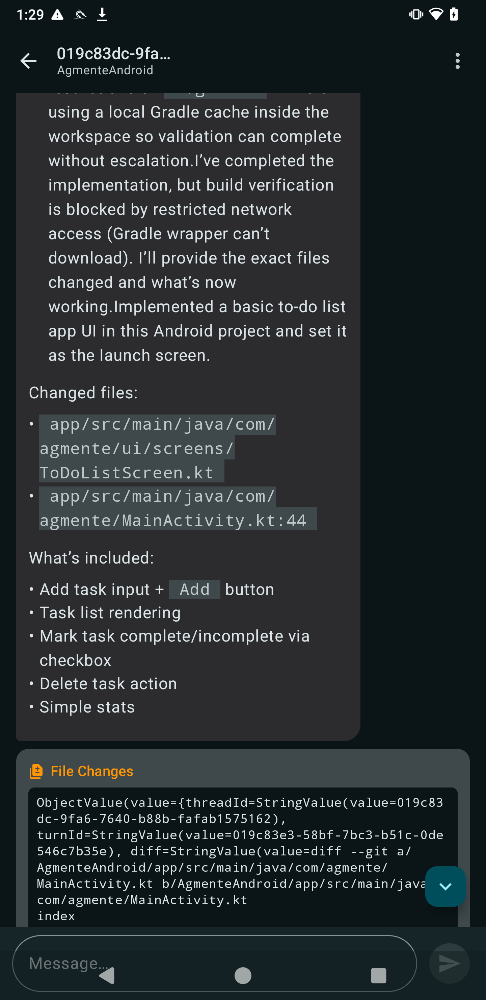

<div align="center">

# 🔥 Agmente

### 🚀 Your AI Coding Agents. In Your Pocket. On Every Platform. 🚀

[](https://swift.org)
[](https://kotlinlang.org)
[](https://reactnative.dev)
[](https://apps.apple.com/us/app/agmente/id6756249477)
[](https://apps.apple.com/us/app/agmente/id6756249477)
[](https://github.com/friuns2/Agmente/releases/latest)
[](LICENSE)
[](#)
[](https://github.com/rebornix/Agmente/stargazers)

<br />

> **Every AI coding agent. Every protocol. One app.**
> **Copilot CLI. Gemini. Claude Code. Codex. Qwen. Vibe.**
> **They all work. From your phone. Yes, really.**

<br />

```
╔═══════════════════════════════════════════════════════╗
║     █████╗  ██████╗ ███╗   ███╗███████╗███╗   ██╗    ║
║    ██╔══██╗██╔════╝ ████╗ ████║██╔════╝████╗  ██║    ║
║    ███████║██║  ███╗██╔████╔██║█████╗  ██╔██╗ ██║    ║
║    ██╔══██║██║   ██║██║╚██╔╝██║██╔══╝  ██║╚██╗██║    ║
║    ██║  ██║╚██████╔╝██║ ╚═╝ ██║███████╗██║ ╚████║    ║
║    ╚═╝  ╚═╝ ╚═════╝ ╚═╝     ╚═╝╚══════╝╚═╝  ╚═══╝    ║
║         T E   M O B I L E   A G E N T   C L I E N T    ║
╚═══════════════════════════════════════════════════════╝
```

</div>

---

## 🤯 What Is This?

Every major tech company shipped an AI coding agent. **Copilot CLI**. **Gemini CLI**. **Claude Code**. **OpenAI Codex**. **Qwen**. **Mistral Vibe**. They're powerful. They're transformative. They run in your terminal.

But what if you're on your couch? On a train? In bed at 2am having a "what if I refactored the entire auth layer" moment?

**Agmente** is a native mobile client that connects to **any** AI coding agent over WebSocket. It speaks both **ACP (Agent Client Protocol)** and **Codex app-server protocol** — auto-detecting which one your server uses. You get the full experience: tool calls, file changes, plan mode, session history, syntax-highlighted code — all from your phone.

Yes, that's a full coding agent interface. Yes, that's on your iPhone. **Yes, it's on the App Store right now.**

---

## 📱 Screenshots

<div align="center">
<table>
<tr>
<td align="center" width="60%">

<br /><b>🍎 iOS — The Full Experience</b><br />
<sub>Server list with connection status. Full chat transcript with <b>tool calls</b>, <b>file changes</b>, and <b>plan mode</b>.</sub>
</td>
</tr>
<tr>
<td>
<table>
<tr>
<td align="center" width="50%">

<br /><b>🤖 Android — Session List</b><br />
<sub>Connected & initialized. Server status, sessions, <b>New Chat</b> button.</sub>
</td>
<td align="center" width="50%">

<br /><b>🤖 Android — Chat View</b><br />
<sub>Tool calls, file changes, markdown rendering — all native Compose.</sub>
</td>
</tr>
</table>
</td>
</tr>
</table>
</div>

---

## 🧠 TL;DR

> Connect your phone to **any AI coding agent** (Copilot, Gemini, Claude Code, Codex, Qwen, Vibe) over WebSocket. See tool calls, edit files, manage sessions — all natively on **iOS**, **Android**, and **React Native**. Auto-detects ACP vs Codex protocol. Ships with a full Swift ACP SDK. **It just works.**

---

## 🌍 What Can You Do With This?

| | Use Case | Description |
|---|---|---|
| 📱 | **Mobile coding agent** | Run Copilot CLI / Gemini / Claude Code from your phone |
| 🔌 | **Connect to any ACP server** | Any agent that speaks Agent Client Protocol — just add the WebSocket URL |
| 🤖 | **Connect to Codex app-server** | OpenAI's experimental app-server protocol — fully supported |
| 🧠 | **Plan mode** | Review Codex plans before execution — approve, reject, iterate |
| 🔧 | **Tool call visibility** | See every file read, write, terminal command the agent executes |
| 📂 | **File changes view** | Inline diffs for every file the agent modifies |
| 🔐 | **Remote access** | Cloudflare Tunnel + Access tokens for secure `wss://` connections |
| 💾 | **Session persistence** | Resume conversations even after app restart — local + server-side |
| 🌐 | **Multi-protocol** | Auto-detects ACP vs Codex after `initialize` — zero config |
| 📋 | **Session management** | Create, list, load, archive sessions/threads per server |
| ⚡ | **Skills & permissions** | Select agent skills, toggle YOLO/Auto Edit/Plan/Default modes |
| 🏗️ | **Three platforms** | iOS (SwiftUI), Android (Compose), React Native — same experience everywhere |

---

## ⚡ Quick Start

### 📲 iOS (App Store)

```bash
# 🎉 Just download it
# https://apps.apple.com/us/app/agmente/id6756249477
```

### 🤖 Android (APK Download)

```bash
# 📦 Grab the latest APK from GitHub Releases
# https://github.com/friuns2/Agmente/releases/latest
# Sideload it — no Play Store needed. No signing drama.
```

### 🏗️ Build from Source (iOS)

```bash
# 🔓 Clone and build
git clone https://github.com/rebornix/Agmente.git
cd Agmente
open Agmente.xcodeproj
# 🚀 Hit Run. You're flying. ✈️
```

### 🤖 Build from Source (Android)

```bash
cd AgmenteAndroid
./gradlew assembleDebug
# 📱 Install on device or emulator
```

### 🔌 Start a Local Agent

```bash
# 🧪 Codex app-server (direct WebSocket)
codex app-server --listen ws://127.0.0.1:8788

# 🌐 ACP agent via stdio-to-ws (Gemini, Claude Code, Copilot, etc.)
npx -y @rebornix/stdio-to-ws --persist --grace-period 604800 "npx @google/gemini-cli --experimental-acp" --port 8765
```

Add your server in the app → Connect → Initialize → **Start coding from your phone.** 🎯

---

## 📁 Project Structure

```
Agmente/
├── 📱 Agmente/                    # iOS app (SwiftUI)
│   ├── 🔌 Networking/             # WebSocket, ACP/Codex clients
│   ├── 🎨 UI/                     # Views, components, screens
│   ├── 🧠 ViewModels/             # ACP & Codex view models
│   └── 💾 Persistence/            # Core Data session storage
├── 🤖 AgmenteAndroid/             # Android app (Kotlin + Compose)
│   ├── 📦 app/                    # Main Android application
│   ├── 🔌 acpclient/              # Kotlin ACP client module
│   └── 🔌 appserverclient/        # Kotlin Codex client module
├── ⚛️  AgmenteRN/                  # React Native app
│   └── 📂 src/                    # TypeScript source
├── 🔧 ACPClient/                  # Swift ACP SDK (SwiftPM)
│   ├── 📖 Docs/                   # Protocol diagrams & logos
│   └── 🧪 Tests/                  # Unit tests
├── 🔧 AppServerClient/            # Swift Codex app-server client
├── 🧪 AgmenteTests/               # iOS unit tests
├── 🧪 AgmenteUITests/             # iOS UI tests
├── 📖 docs/                       # Documentation & screenshots
├── 📋 Scenarios/                  # User scenario guides
└── ⚙️  .github/                    # CI workflows & GitHub config
```

---

## 🔌 Supported Agents

> **If it speaks ACP or Codex protocol — it works.**

| Agent | Protocol | Command |
|-------|----------|---------|
| 🟢 **GitHub Copilot CLI** | ACP | `copilot --acp` |
| 🔵 **Google Gemini CLI** | ACP | `npx @google/gemini-cli --experimental-acp` |
| 🟣 **Claude Code** | ACP | `npx @zed-industries/claude-code-acp` |
| ⚫ **OpenAI Codex** | Codex | `codex app-server --listen ws://...` |
| 🟠 **Qwen** | ACP | `qwen --experimental-acp` |
| 🔴 **Mistral Vibe** | ACP | `vibe-acp` |
| 🟡 **Any ACP agent** | ACP | Bring your own! |

---

## 🏗️ Architecture

```
┌─────────────────────────────────────────────────────────────┐
│                        📱 Agmente App                       │
│  ┌──────────────┐  ┌──────────────┐  ┌──────────────────┐  │
│  │  iOS (Swift)  │  │Android (Kt)  │  │  React Native    │  │
│  └──────┬───────┘  └──────┬───────┘  └────────┬─────────┘  │
│         │                 │                    │             │
│  ┌──────▼─────────────────▼────────────────────▼─────────┐  │
│  │              Protocol Auto-Detection                  │  │
│  │         (initialize → check userAgent)                │  │
│  └──────────────┬──────────────────┬─────────────────────┘  │
│                 │                  │                         │
│  ┌──────────────▼──────┐ ┌────────▼──────────────────┐     │
│  │    ACP Client       │ │    Codex Client            │     │
│  │  session/new        │ │  thread/start              │     │
│  │  session/prompt     │ │  turn/start                │     │
│  │  session/cancel     │ │  turn/interrupt            │     │
│  │  session/list       │ │  thread/list               │     │
│  │  session/load       │ │  thread/resume             │     │
│  └──────────┬──────────┘ └────────┬──────────────────┘     │
│             │                     │                         │
└─────────────┼─────────────────────┼─────────────────────────┘
              │    WebSocket        │    WebSocket
              ▼                     ▼
    ┌─────────────────┐   ┌─────────────────┐
    │  ACP Agent      │   │  Codex Server   │
    │  (stdio-to-ws)  │   │  (app-server)   │
    └─────────────────┘   └─────────────────┘
```

---

## 🎯 Requirements

- 🍎 **iOS**: Xcode (latest stable), macOS, iOS 17+
- 🤖 **Android**: Android Studio, Kotlin 2.0, API 26+
- ⚛️ **React Native**: Node.js 18+, React Native 0.84
- 🔌 **Agent**: Any ACP or Codex-compatible server

---

## 🔒 Remote Agent Setup

> **Run your agent on a beefy remote machine. Control it from your phone.**

```bash
# 🌐 Start agent on remote host
npx -y @rebornix/stdio-to-ws --persist --grace-period 604800 "copilot --acp" --port 8765

# 🔐 Expose via Cloudflare Tunnel
cloudflared tunnel --url http://localhost:8765

# 📱 Add wss:// endpoint in Agmente → Connect → Code from anywhere
```

Full guide: [`setup.md`](setup.md) | Quick reference: [`docs/remote-agent.md`](docs/remote-agent.md)

---

## 🧪 Tests

```bash
# 🍎 iOS app tests
xcodebuild -project Agmente.xcodeproj \
  -scheme Agmente \
  -destination "platform=iOS Simulator,name=iPhone 16" \
  test

# 📦 ACPClient package tests
swift test --package-path ACPClient

# 🤖 Android tests
cd AgmenteAndroid && ./gradlew test
```

---

## 🐛 Troubleshooting

| Problem | Solution |
|---------|----------|
| 🔴 Can't connect to agent | Check WebSocket URL scheme (`ws://` for local, `wss://` for remote) |
| 🔴 Session creation fails with ENOENT | Leave working directory empty, or set a valid path on the agent host |
| 🔴 Agent disconnects on iOS background | Use `--persist` flag with `stdio-to-ws` — it buffers messages during disconnection |
| 🔴 Codex protocol not detected | Ensure your Codex server returns a `codex/…` userAgent in `initialize` response |
| 🔴 Port already in use | Run `pkill -9 -f "stdio-to-ws.*8765"` to kill stale processes |

---

## 🤝 Contributing

We welcome contributions! Check the open [issues](https://github.com/rebornix/Agmente/issues) and submit a PR.

- 📖 See [`CONTRIBUTING.md`](CONTRIBUTING.md) for guidelines
- 🔒 See [`SECURITY.md`](SECURITY.md) for security policy
- 📋 See [`CODE_OF_CONDUCT.md`](CODE_OF_CONDUCT.md) for community standards

---

## ⭐ Star This Repo

If you believe **AI coding agents** should be accessible from **anywhere** — not just your terminal — smash that star button. ⭐

Every agent. Every protocol. Every platform. **One app.**

[](https://github.com/rebornix/Agmente/stargazers)
[](https://github.com/rebornix/Agmente/network)

---

<div align="center">

**Built with SwiftUI, Kotlin Compose, and an unhealthy obsession with mobile agent UX** 🔬

*They said "just use the terminal." We said "hold my phone."* 😏

</div>
